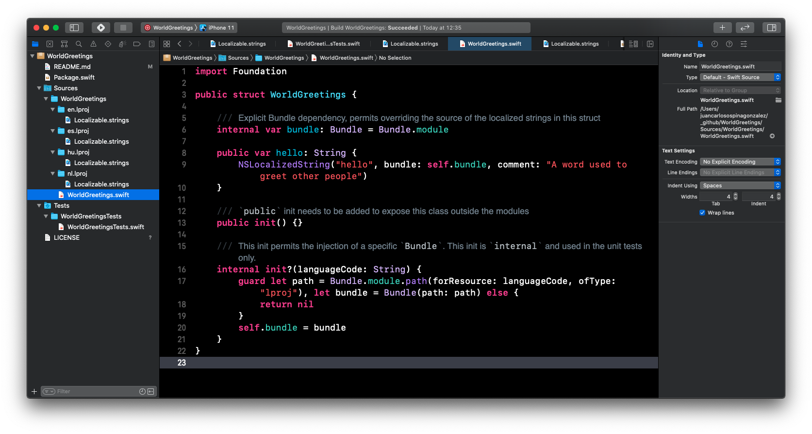
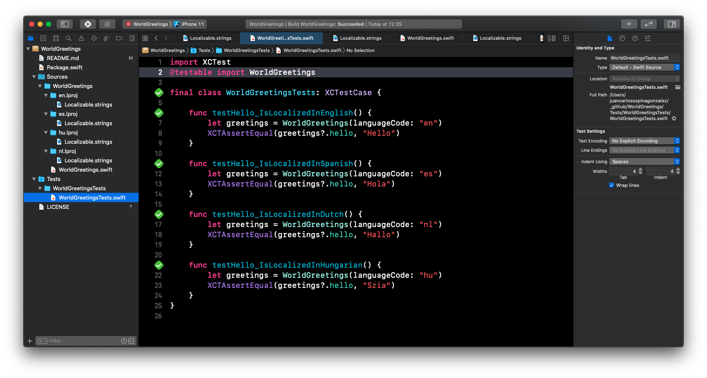

# WorldGreeter (SPM Package)

A simple SPM package that demonstrates localization support using swift 5.3

Additionally, this package shows an example on how to inject `Bundle` as an explicit dependency.

This allows us to work around the lack of support for `.xctestcase` on SPM.

Here, we override the `Bundle` to load different languages at runtime in some unit tests. 

Full motivation for this can be found here: [A closer look at localization with Swift Package Manager](http://piterwilson.com/blog/localization-with-swift-package-manager)